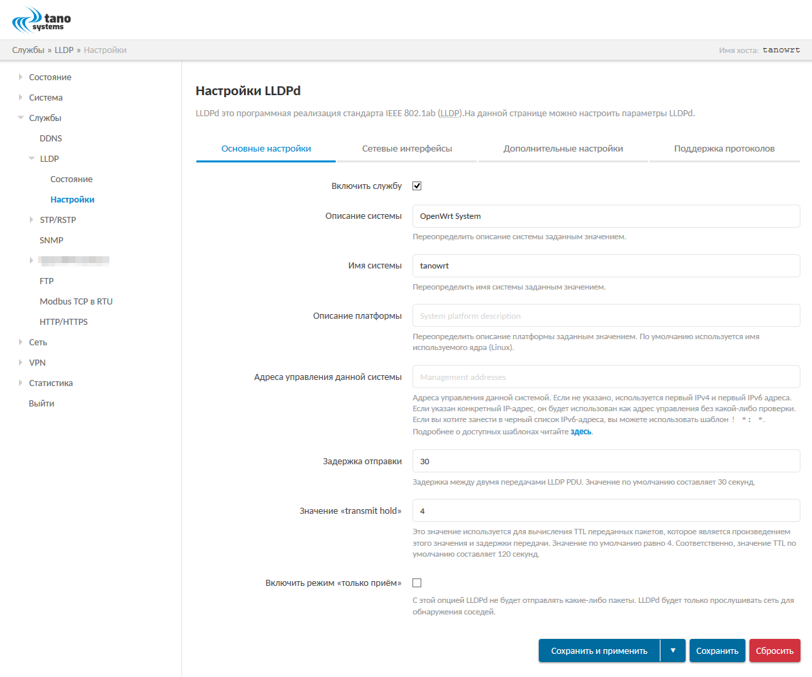
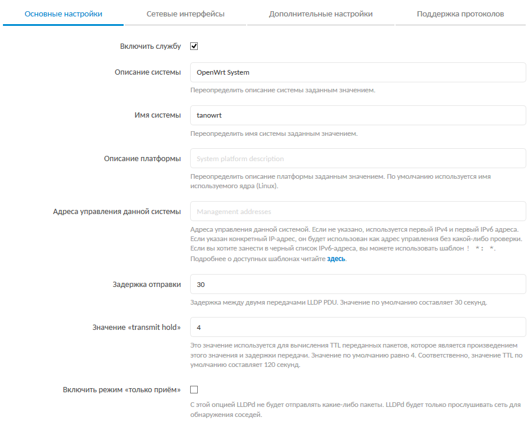
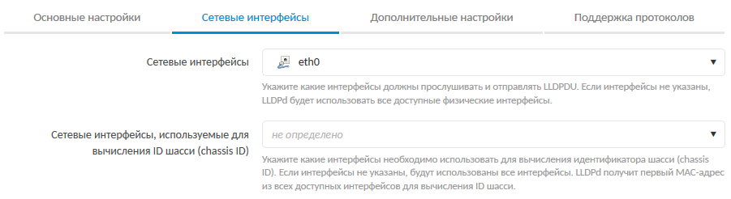
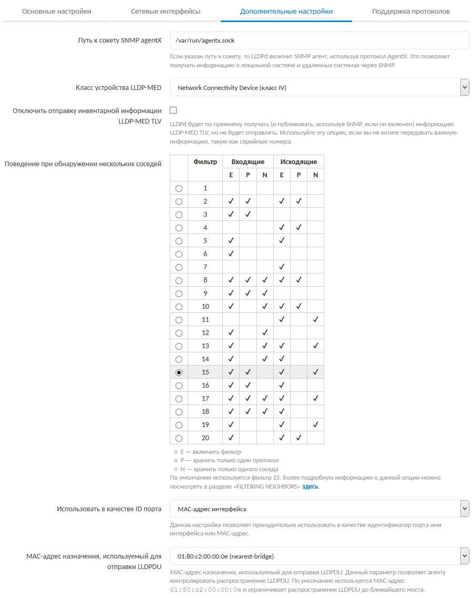
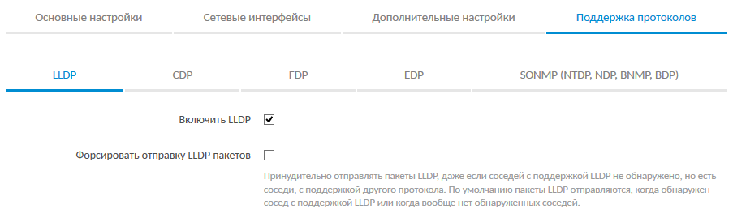
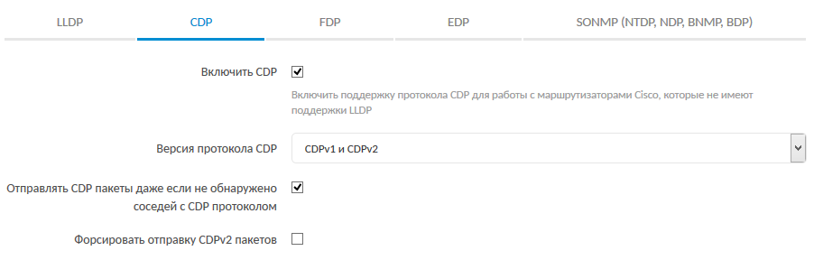
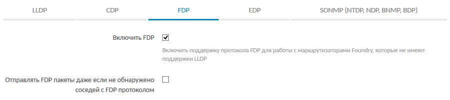
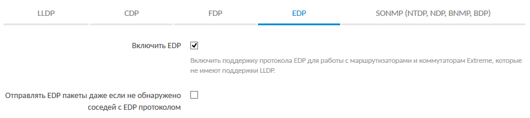
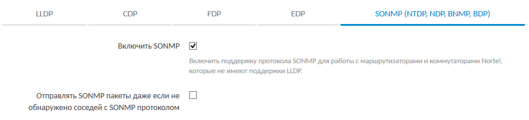

==================================
Конфигурация
==================================

Конфигурация службы LLDPd_ осуществляется в подразделе "Настройки"
(раздел главного меню :menuselection:`Службы --> LLDP`).

Страница настрек разделена на следующие вкладки:

- "Основные настройки" (см. :numref:`sec-config-general`)
- "Сетевые интерфейсы" (см. :numref:`sec-config-network`)
- "Дополнительные настройки" (см. :numref:`sec-config-advanced`)
- "Поддержка протоколов" (см. :numref:`sec-config-protocols`)

.. _sec-config-general:

Основные настройки
==================

Внешний вид вкладки "Основные настройки" показан на :numref:`fig-config-tab-general`.

.. _fig-config-tab-general:

    Вкладка "Основные настройки"

Включить службу
---------------

.. list-table::
   :widths: 30 70
   :class: full-width
   :header-rows: 0

   * - Значение по умолчанию
     - *включено*
   * - UCI-опция
     - *нет*

Включение или отключение автоматического запуска службы LLDPd_ при запуске системы.

Описание системы
-----------------

.. list-table::
   :widths: 30 70
   :class: full-width
   :header-rows: 0

   * - Значение по умолчанию
     - *нет*
   * - UCI-опция
     - ``lldpd.config.lldp_description``

Текстовое описание системы. Данное значение будет передаваться другим устройствам
по сети через включенные протоколы обнаружения.

.. _sec-config-general-sysname:

Имя системы
---------------

.. list-table::
   :widths: 30 70
   :class: full-width
   :header-rows: 0

   * - Значение по умолчанию
     - *нет*
   * - UCI-опция
     - ``lldpd.config.lldp_hostname``

Имя системы. Данное значение будет передаваться другим устройствам
по сети через включенные протоколы обнаружения.

.. _sec-config-general-sysdescr:

Описание платформы
-------------------

.. list-table::
   :widths: 30 70
   :class: full-width
   :header-rows: 0

   * - Значение по умолчанию
     - *нет*
   * - UCI-опция
     - ``lldpd.config.lldp_platform``

Текстовое описание платформы. Данное значение будет передаваться другим устройствам
по сети через включенные протоколы обнаружения.

Если значение не указано, будет использовано имя ядра системы (Linux).

.. _sec-config-general-mgmt-ip:

Адреса управления данной системы
---------------------------------

.. list-table::
   :widths: 30 70
   :class: full-width
   :header-rows: 0

   * - Значение по умолчанию
     - *нет*
   * - UCI-опция
     - ``lldpd.config.lldp_sys_mgmt_ip``

Адреса управления данной системой. Если не указано, то используется первый IPv4
и первый IPv6 адреса. Если указан конкретный IP-адрес, то он будет использован как адрес
управления без какой-либо проверки. Если необходимо занести в черный список
IPv6-адреса, то можно использовать шаблон ``! *: *``.

.. note::
  Подробная информация о доступных шаблонах данного параметра
  приведена в `официальной документации <https://vincentbernat.github.io/lldpd/usage.html>`_
  службы LLDPd_.

Задержка отправки
--------------------

.. list-table::
   :widths: 30 70
   :class: full-width
   :header-rows: 0

   * - Значение по умолчанию
     - ``30``
   * - UCI-опция
     - ``lldpd.config.lldp_tx_interval``

Задержка между двумя передачами LLDP PDU. Значение по умолчанию
составляет 30 секунд.

Значение "transmit hold"
---------------------------

.. list-table::
   :widths: 30 70
   :class: full-width
   :header-rows: 0

   * - Значение по умолчанию
     - ``4``
   * - UCI-опция
     - ``lldpd.config.lldp_tx_hold``

Это значение используется для вычисления :term:`TTL` переданных пакетов,
которое является произведением этого значения и задержки передачи.
Значение по умолчанию равно 4. Соответственно значение :term:`TTL` по
умолчанию составляет 120 секунд.

Включить режим "только приём"
-------------------------------

.. list-table::
   :widths: 30 70
   :class: full-width
   :header-rows: 0

   * - Значение по умолчанию
     - ``0`` (отключено)
   * - UCI-опция
     - ``lldpd.config.readonly_mode``

Управление режимом "только приём". В режиме "только приём"
служба LLDPd_ не выполняет отправку пакетов. Выполняется
только приём и анализ пакетов.

.. _sec-config-network:

Сетевые интерфейсы
==================

Внешний вид вкладки "Сетевые интерфейсы" показан на :numref:`fig-config-tab-network`.

.. _fig-config-tab-network:

    Вкладка "Сетевые интерфейсы"

Сетевые интерфейсы
------------------

.. list-table::
   :widths: 30 70
   :class: full-width
   :header-rows: 0

   * - Значение по умолчанию
     - *нет*
   * - UCI-опция
     - ``lldpd.config.interface``

Выбор сетевых интерфейсов, которые будут прослушивать и
отправлять пакеты :term:`LLDPDU`. Если не указан ни один интерфейс,
служба LLDPd_ будет использовать все доступные физические интерфейсы.

.. _sec-config-network-mgmt-ifaces:

Сетевые интерфейсы, используемые для вычисления ID шасси (chassis ID)
---------------------------------------------------------------------

.. list-table::
   :widths: 30 70
   :class: full-width
   :header-rows: 0

   * - Значение по умолчанию
     - *нет*
   * - UCI-опция
     - ``lldpd.config.cid_interface``

Выбор сетевых интерфейсов, которые должны использоваться для
вычисления идентификатора шасси (chassis ID). Если интерфейсы
не указаны, то будут иcпользованы все интерфейсы. В этом случае
служба LLDPd_ будет использовать первый MAC-адрес из всех доступных
интерфейсов для вычисления ID шасси.

.. _sec-config-advanced:

Дополнительные настройки
========================

Внешний вид вкладки "Дополнительные настройки" показан на :numref:`fig-config-tab-advanced`.

.. _fig-config-tab-advanced:

    Вкладка "Дополнительные настройки"

Путь к сокету SNMP agentX
-------------------------

.. list-table::
   :widths: 30 70
   :class: full-width
   :header-rows: 0

   * - Значение по умолчанию
     - ``/var/run/agentx.sock``
   * - UCI-опция
     - ``lldpd.config.agentxsocket``

Если указан путь к сокету :term:`SNMP` агента, то служба
LLDPd_ включит :term:`SNMP` агент, используя протокол AgentX.
Это позволяет получать информацию о локальной системе и
удаленных системах по протоколу :term:`SNMP`.

Класс устройства LLDP-MED
-------------------------

.. list-table::
   :widths: 30 70
   :class: full-width
   :header-rows: 0

   * - Значение по умолчанию
     - ``4``
   * - UCI-опция
     - ``lldpd.config.lldp_class``

Выбор класса устройства LLDP-MED. Доступные значения приведены в таблице:

.. list-table::
   :class: full-width
   :header-rows: 1

   * - Значение LuCI
     - Значение UCI
   * - Generic Endpoint (класс I)
     - ``1``
   * - Media Endpoint (класс II)
     - ``2``
   * - Communication Device Endpoints (класс III)
     - ``3``
   * - Network Connectivity Device (класс IV)
     - ``4``

Отключить отправку инвентарной информации LLDP-MED TLV
------------------------------------------------------

.. list-table::
   :widths: 30 70
   :class: full-width
   :header-rows: 0

   * - Значение по умолчанию
     - ``0`` (отключено)
   * - UCI-опция
     - ``lldpd.config.lldpmed_no_inventory``

Отключение отправки инвентарной информации :term:`LLDP-MED` :term:`TLV`.

Служба LLDPd_ будет по прежнему получать (и публиковать,
используя :term:`SNMP`, если он включен) информацию :term:`LLDP-MED` :term:`TLV`,
но не будет её отправлять. Используйте эту опцию, если вы не
хотите передавать важную информацию, например, такую как серийные номера.

Поведение при обнаружении нескольких соседей
--------------------------------------------

.. list-table::
   :widths: 30 70
   :class: full-width
   :header-rows: 0

   * - Значение по умолчанию
     - ``15``
   * - UCI-опция
     - ``lldpd.config.filter``

Определяет поведение при обнаружении нескольких соседей на одном порту.

В гетерогенных сетях вы можете видеть несколько различных хостов на
одном и том же порту, даже если к этому порту физически подключен только один.
Например, если у вас есть коммутатор Nortel с запущенным :term:`LLDP`, который
подключен к коммутатору Cisco, работающему по протоколу :term:`CDP`, и ваш
хост подключен к Cisco коммутатору, вы увидите также и Nortel коммутатор,
потому что :term:`LLDP` кадры будут перенаправляться коммутатором Cisco.

Входящая и исходящая фильтрация не связаны между собой.
Входящая фильтрация позволяет скрывать некоторые удаленные порты,
чтобы вы могли точно знать, какое оборудование находится по другую
сторону сетевого кабеля. Фильтрация исходящих кадров позволит запретить
использование некоторых протоколов, чтобы избежать флудинга сети протоколами,
которые никак не обрабатываются ближайшим оборудованием.

.. note::
  Следует иметь в виду, что без фильтрации служба LLDPd_ будет
  "общаться" по всем протоколам, для которых был получен хотя бы
  один кадр, а :term:`LLDP` --- нет.

При включении входящей фильтрации служба LLDPd_ попытается выбрать
один протокол и отфильтровать соседей, использующих другие протоколы.
Для выбора протокола правило заключается в том, чтобы взять менее используемый
протокол. Если на одном порту вы получаете 12 соседей :term:`CDP` и 1 соседа :term:`LLDP`,
то это значит, что удаленный коммутатор "общается" на :term:`LLDP` и не фильтрует :term:`CDP`.
Поэтому выбирается :term:`LLDP`. При включении исходящей фильтрации служба LLDPd_
также попытается выбрать один протокол и будет "общаться" только по этому
протоколу. Фильтрация производится по портам. Каждый порт может иметь
различный протокол.

При включении фильтрации имеется два дополнительных критерия:

- разрешение выбрать один или несколько протоколов (в случае ничьей);
- разрешение выбрать одного или нескольких соседей.

Правило выбора протоколов с меньшим количеством соседей применяется
Даже если разрешено несколько протоколов. Если служба LLDPd_
выбирает :term:`LLDP` и :term:`CDP`, это означает, что у них одинаковое количество соседей.
Выбор соседей происходит случайным образом. Входящая фильтрация будет
выбирать набор соседей, которые будут отображаться. Исходящая фильтрация
будет использовать выбранный набор соседей, чтобы решить какие протоколы
использовать: если выбранный сосед "общается" через :term:`LLDP`,
а другой --- через :term:`CDP`, то LLDPd_ будет "общаться"
и через :term:`CDP`, и через :term:`LLDP` на этом порту.

Есть несколько граничных случаев. Типичный пример --- коммутатор, "общающийся"
на двух протоколах (например, :term:`CDP` и :term:`LLDP`). Вы хотите получить информацию
по лучшему протоколу, но хотите "общаться" на обоих протоколах, потому что
некоторые инструменты используют таблицу :term:`CDP`, а другие --- :term:`LLDP`.

В таблице ниже приведены все возможные значения фильтрации.
Значение по умолчанию равно 15, что соответствует граничному случаю,
описанному выше. Столбец "filter" означает, что фильтрация включена.
Столбец "1proto" говорит о том, что будет сохранен только один протокол.
Столбец "1neigh" говорит о том, что будет сохранен только один сосед.

.. table:: Возможные значения фильтрации входящих и исходящих пакетов

    +------------+--------------------------+--------------------------+
    |            | Входящая фильтрация      | Исходящая фильтрация     |
    | Значение   +--------+--------+--------+--------+--------+--------+
    |            | filter | 1proto | 1neigh | filter | 1proto | 1neigh |
    +============+========+========+========+========+========+========+
    | 0          |        |        |        |        |        |        |
    +------------+--------+--------+--------+--------+--------+--------+
    | 1          | ✔      | ✔      |        | ✔      | ✔      |        |
    +------------+--------+--------+--------+--------+--------+--------+
    | 2          | ✔      | ✔      |        |        |        |        |
    +------------+--------+--------+--------+--------+--------+--------+
    | 3          |        |        |        | ✔      | ✔      |        |
    +------------+--------+--------+--------+--------+--------+--------+
    | 4          | ✔      |        |        | ✔      |        |        |
    +------------+--------+--------+--------+--------+--------+--------+
    | 5          | ✔      |        |        |        |        |        |
    +------------+--------+--------+--------+--------+--------+--------+
    | 6          |        |        |        | ✔      |        |        |
    +------------+--------+--------+--------+--------+--------+--------+
    | 7          | ✔      | ✔      | ✔      | ✔      | ✔      |        |
    +------------+--------+--------+--------+--------+--------+--------+
    | 8          | ✔      | ✔      | ✔      |        |        |        |
    +------------+--------+--------+--------+--------+--------+--------+
    | 9          | ✔      |        | ✔      | ✔      | ✔      |        |
    +------------+--------+--------+--------+--------+--------+--------+
    | 10         |        |        |        | ✔      |        | ✔      |
    +------------+--------+--------+--------+--------+--------+--------+
    | 11         | ✔      |        | ✔      |        |        |        |
    +------------+--------+--------+--------+--------+--------+--------+
    | 12         | ✔      |        | ✔      | ✔      |        | ✔      |
    +------------+--------+--------+--------+--------+--------+--------+
    | 13         | ✔      |        | ✔      | ✔      |        |        |
    +------------+--------+--------+--------+--------+--------+--------+
    | 14         | ✔      | ✔      |        | ✔      |        | ✔      |
    +------------+--------+--------+--------+--------+--------+--------+
    | 15         | ✔      | ✔      |        | ✔      |        |        |
    +------------+--------+--------+--------+--------+--------+--------+
    | 16         | ✔      | ✔      | ✔      | ✔      |        | ✔      |
    +------------+--------+--------+--------+--------+--------+--------+
    | 17         | ✔      | ✔      | ✔      | ✔      |        |        |
    +------------+--------+--------+--------+--------+--------+--------+
    | 18         | ✔      |        |        | ✔      |        | ✔      |
    +------------+--------+--------+--------+--------+--------+--------+
    | 19         | ✔      |        |        | ✔      | ✔      |        |
    +------------+--------+--------+--------+--------+--------+--------+

.. _sec-config-advanced-portidsubtype:

Использовать в качестве ID порта
--------------------------------

.. list-table::
   :widths: 30 70
   :class: full-width
   :header-rows: 0

   * - Значение по умолчанию
     - ``macaddress``
   * - UCI-опция
     - ``lldpd.config.lldp_portidsubtype``

Позволяет выбрать что использовать в качестве идентификатора
порта --- MAC-адрес или имя интерфейса. Доступные значения приведены в таблице:

===================== ============== ========================================================================
Значение LuCI         Значение UCI   Описание
===================== ============== ========================================================================
MAC-адрес интерфейса  ``macaddress`` В качестве идентификатора порта будет использован MAC-адрес интерфейса.
Имя интерфейса        ``ifname``     В качестве идентификатора порта будет использовано имя интерфейса.
===================== ============== ========================================================================

MAC-адрес назначения, используемый для отправки LLDPDU
------------------------------------------------------

.. list-table::
   :widths: 30 70
   :class: full-width
   :header-rows: 0

   * - Значение по умолчанию
     - ``nearest-bridge``
   * - UCI-опция
     - ``lldpd.config.lldp_agenttype``

MAC-адрес назначения, используемый для отправки :term:`LLDPDU`. Данный параметр позволяет
агенту контролировать распространение :term:`LLDPDU`. По умолчанию используется MAC-адрес
``01:80:c2:00:00:0e`` и ограничивает распространение :term:`LLDPDU` до ближайшего моста.
Доступные значения приведены в таблице:

============================================ =========================== ========================================================================
Значение LuCI                                Значение UCI                Описание
============================================ =========================== ========================================================================
01:80:c2:00:00:0e (nearest-bridge)           ``nearest-bridge``          :term:`LLDPDU` будут отпавляться на MAC-адрес ``01:80:c2:00:00:0e``.
01:80:c2:00:00:03 (nearest-nontpmr-bridge)   ``nearest-nontpmr-bridge``  :term:`LLDPDU` будут отпавляться на MAC-адрес ``01:80:c2:00:00:03``.
01:80:c2:00:00:00 (nearest-customer-bridge)  ``nearest-customer-bridge`` :term:`LLDPDU` будут отпавляться на MAC-адрес ``01:80:c2:00:00:00``.
============================================ =========================== ========================================================================

.. _sec-config-protocols:

Поддержка протоколов
====================

Вкладка "Поддержка протоколов" дополнительно разделена на подвкладки
для настроек каждого из поддерживаемых протоколов:

- :term:`LLDP` (см. :numref:`sec-config-protocols-lldp`);
- :term:`CDP` (см. :numref:`sec-config-protocols-cdp`);
- :term:`FDP` (см. :numref:`sec-config-protocols-fdp`);
- :term:`EDP` (см. :numref:`sec-config-protocols-edp`);
- :term:`SONMP`, :term:`NTDP`, :term:`BNMP`, :term:`NDP`, :term:`BDP` (см. :numref:`sec-config-protocols-sonmp`).

.. _sec-config-protocols-lldp:

Протокол LLDP
-------------

Внешний вид вкладки с настройками протокола :term:`LLDP` показан
на :numref:`fig-config-tab-protocols-lldp`.

.. _fig-config-tab-protocols-lldp:

    Вкладка "Поддержка протоколов". Настройки протокола :term:`LLDP`

Включить LLDP
^^^^^^^^^^^^^

.. list-table::
   :widths: 30 70
   :class: full-width
   :header-rows: 0

   * - Значение по умолчанию
     - ``1`` (включено)
   * - UCI-опция
     - ``lldpd.config.enable_lldp``

Опция включает поддержку протокола :term:`LLDP`.

Форсировать отправку LLDP пакетов
^^^^^^^^^^^^^^^^^^^^^^^^^^^^^^^^^

.. list-table::
   :widths: 30 70
   :class: full-width
   :header-rows: 0

   * - Значение по умолчанию
     - ``0`` (отключено)
   * - UCI-опция
     - ``lldpd.config.force_lldp``

Опция управляет принудительной отправкой пакетов :term:`LLDP`, даже если соседей
с поддержкой :term:`LLDP` не обнаружено, но есть соседи, с поддержкой
другого протокола. По умолчанию пакеты :term:`LLDP` отправляются,
когда обнаружен сосед с поддержкой :term:`LLDP` или когда вообще
нет обнаруженных соседей.

.. _sec-config-protocols-cdp:

Протокол CDP
------------

Внешний вид вкладки с настройками протокола :term:`CDP` показан
на :numref:`fig-config-tab-protocols-cdp`.

.. _fig-config-tab-protocols-cdp:

    Вкладка "Поддержка протоколов". Настройки протокола :term:`CDP`

Включить CDP
^^^^^^^^^^^^

.. list-table::
   :widths: 30 70
   :class: full-width
   :header-rows: 0

   * - Значение по умолчанию
     - ``1`` (включено)
   * - UCI-опция
     - ``lldpd.config.enable_cdp``

Опция включает поддержку протокола :term:`CDP`.

Версия протокола CDP
^^^^^^^^^^^^^^^^^^^^

.. list-table::
   :widths: 30 70
   :class: full-width
   :header-rows: 0

   * - Значение по умолчанию
     - ``cdpv1v2`` (CDPv1 и CDPv2)
   * - UCI-опция
     - ``lldpd.config.cdp_version``

Опция позволяет выбрать поддерживамые версии протокола :term:`CDP`.
Доступные значения приведены в таблице:

========================= ============ ========================================================================
Значение LuCI             Значение UCI Описание
========================= ============ ========================================================================
CDPv1 и CDPv2             ``cdpv1v2``  Поддерживается протокол :term:`CDP` версий 1 и 2.
Только CDPv2              ``cdpv2``    Поддерживается только версия 2 протокола :term:`CDP`.
========================= ============ ========================================================================

Отправлять СDP пакеты даже если не обнаружено соседей с СDP протоколом
^^^^^^^^^^^^^^^^^^^^^^^^^^^^^^^^^^^^^^^^^^^^^^^^^^^^^^^^^^^^^^^^^^^^^^

.. list-table::
   :widths: 30 70
   :class: full-width
   :header-rows: 0

   * - Значение по умолчанию
     - ``0`` (отключено)
   * - UCI-опция
     - ``lldpd.config.force_cdp``

Если опция включена, то пакеты :term:`CDP` будут отправляться вне зависимости
от того, обнаружен ли сосед с поддержкой протокола :term:`CDP`.

Форсировать отправку CDPv2 пакетов
^^^^^^^^^^^^^^^^^^^^^^^^^^^^^^^^^^

.. list-table::
   :widths: 30 70
   :class: full-width
   :header-rows: 0

   * - Значение по умолчанию
     - ``0`` (отключено)
   * - UCI-опция
     - ``lldpd.config.force_cdpv2``

.. note::
  Опция доступна только в случае выбора "CDPv1 и CDPv2" для опции "Версия протокола CDP"
  и включенной опции "Отправлять СDP пакеты даже если не обнаружено соседей с СDP протоколом".

Если опция включена, то будут принудительно отправляться пакеты протокола :term:`CDP`
версии 2.

.. _sec-config-protocols-fdp:

Протокол FDP
------------

Внешний вид вкладки с настройками протокола :term:`FDP` показан
на :numref:`fig-config-tab-protocols-fdp`.

.. _fig-config-tab-protocols-fdp:

    Вкладка "Поддержка протоколов". Настройки протокола :term:`FDP`

Включить FDP
^^^^^^^^^^^^

.. list-table::
   :widths: 30 70
   :class: full-width
   :header-rows: 0

   * - Значение по умолчанию
     - ``1`` (включено)
   * - UCI-опция
     - ``lldpd.config.enable_fdp``

Опция включает поддержку протокола :term:`FDP`.

Отправлять FDP пакеты даже если не обнаружено соседей с FDP протоколом
^^^^^^^^^^^^^^^^^^^^^^^^^^^^^^^^^^^^^^^^^^^^^^^^^^^^^^^^^^^^^^^^^^^^^^

.. list-table::
   :widths: 30 70
   :class: full-width
   :header-rows: 0

   * - Значение по умолчанию
     - ``0`` (отключено)
   * - UCI-опция
     - ``lldpd.config.force_fdp``

Если опция включена, то пакеты :term:`FDP` будут отправляться вне зависимости
от того, обнаружен ли сосед с поддержкой протокола :term:`FDP`.

.. _sec-config-protocols-edp:

Протокол EDP
------------

Внешний вид вкладки с настройками протокола :term:`EDP` показан
на :numref:`fig-config-tab-protocols-edp`.

.. _fig-config-tab-protocols-edp:

    Вкладка "Поддержка протоколов". Настройки протокола :term:`EDP`

Включить EDP
^^^^^^^^^^^^

.. list-table::
   :widths: 30 70
   :class: full-width
   :header-rows: 0

   * - Значение по умолчанию
     - ``1`` (включено)
   * - UCI-опция
     - ``lldpd.config.enable_edp``

Опция включает поддержку протокола :term:`EDP`.

Отправлять EDP пакеты даже если не обнаружено соседей с EDP протоколом
^^^^^^^^^^^^^^^^^^^^^^^^^^^^^^^^^^^^^^^^^^^^^^^^^^^^^^^^^^^^^^^^^^^^^^

.. list-table::
   :widths: 30 70
   :class: full-width
   :header-rows: 0

   * - Значение по умолчанию
     - ``0`` (отключено)
   * - UCI-опция
     - ``lldpd.config.force_edp``

Если опция включена, то пакеты :term:`EDP` будут отправляться
вне зависимости от того, обнаружен ли сосед с поддержкой
протокола :term:`EDP`.

.. _sec-config-protocols-sonmp:

Протокол SONMP
--------------

Внешний вид вкладки с настройками протокола :term:`SONMP` показан
на :numref:`fig-config-tab-protocols-sonmp`.

.. _fig-config-tab-protocols-sonmp:

    Вкладка "Поддержка протоколов". Настройки протокола :term:`SONMP`

Включить SONMP
^^^^^^^^^^^^^^

.. list-table::
   :widths: 30 70
   :class: full-width
   :header-rows: 0

   * - Значение по умолчанию
     - ``1`` (включено)
   * - UCI-опция
     - ``lldpd.config.enable_sonmp``

Опция включает поддержку протокола :term:`SONMP`.

Отправлять SONMP пакеты даже если не обнаружено соседей с SONMP протоколом
^^^^^^^^^^^^^^^^^^^^^^^^^^^^^^^^^^^^^^^^^^^^^^^^^^^^^^^^^^^^^^^^^^^^^^^^^^

.. list-table::
   :widths: 30 70
   :class: full-width
   :header-rows: 0

   * - Значение по умолчанию
     - ``0`` (отключено)
   * - UCI-опция
     - ``lldpd.config.force_sonmp``

Если опция включена, то пакеты :term:`SONMP` будут отправляться вне зависимости
от того, обнаружен ли сосед с поддержкой протокола :term:`SONMP`.

