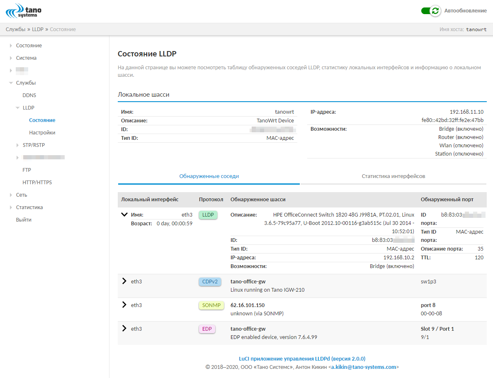
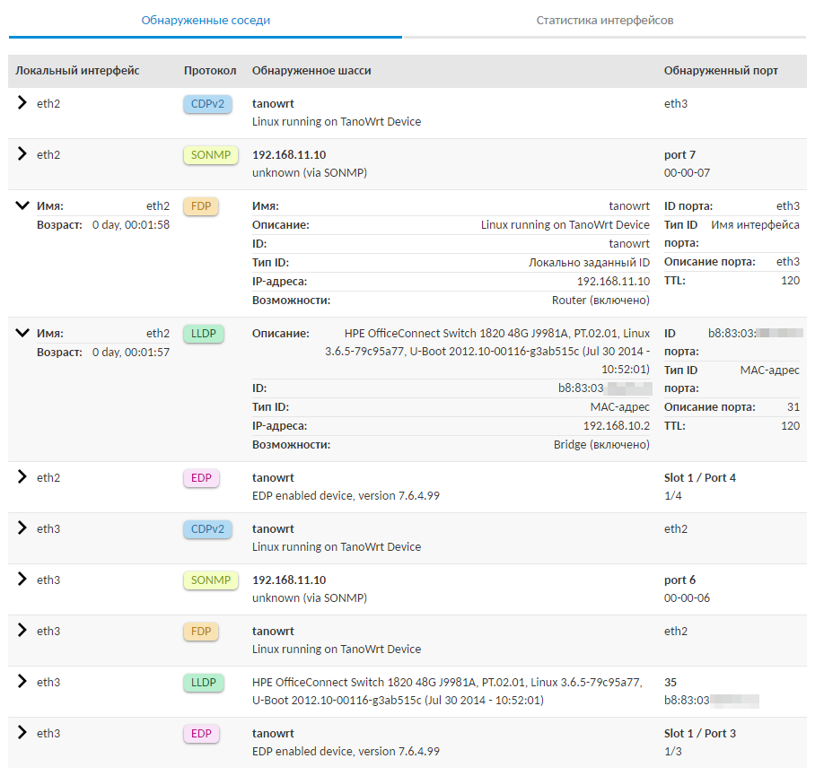
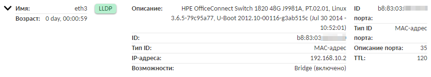
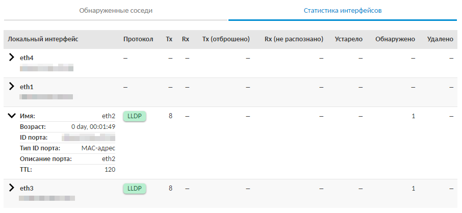
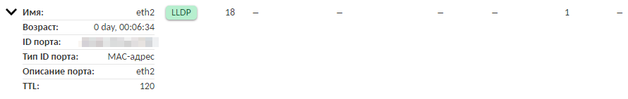

==================================
Мониторинг состояния
==================================

Мониторинг состояния службы LLDPd_ осуществляется в подразделе "Состояние"
(раздел главного меню :menuselection:`Службы --> LLDP`).

В самом начале страницы "Состояние" отображается подраздел с информацией
о локальном шасси в виде таблицы. Описание параметров локального
шасси приведено в таблице ниже (:numref:`table-local-chassis-params`).

.. _table-local-chassis-params:

.. list-table:: Параметры локального шасси
   :widths: 30 70
   :header-rows: 1

   * - Параметр
     - Описание

   * - Имя
     - Имя системы. Конфигурируется при помощи опции,
       описанной в разделе :ref:`sec-config-general-sysname`.

   * - Описание
     - Идентификатор. Может быть сконфигурирован при помощи
       опции :ref:`sec-config-general-sysdescr`.

   * - ID
     - Описание системы. Конфигурируется при помощи опции
       :ref:`sec-config-network-mgmt-ifaces`.

   * - Тип ID
     - Тип идентификатора (MAC-адрес или имя интерфейса).
       Конфигурируется при помощи опции :ref:`sec-config-advanced-portidsubtype`.

   * - IP-адреса
     - Список IP-адресов управления данной системой. Может быть сконфигурировано
       при помощи опции :ref:`sec-config-general-mgmt-ip`

   * - Возможности
     - Список возможностей данной системы. Значение не конфигурируется.

Далее на странице "Состояние" расположены таблицы обнаруженных соседей
(см. :numref:`sec-status-neighbors`) и статистики интерфейсов
(см. :numref:`sec-status-stats`) в соответствующих вкладках.

.. _sec-status-neighbors:

Таблица обнаруженных соседей
============================

Пример внешнего вида вкладки с таблицей обнаруженных соседей приведен
на рисунке ниже (:numref:`fig-status-tab-neighbors`).

.. _fig-status-tab-neighbors:

    Таблица обнаруженных соседей

Строки таблицы имеют два режима отображения информации --- компактный
(см. :numref:`fig-status-neighbor-collapsed`) и расширенный
(см. :numref:`fig-status-neighbor-expanded`).
Переключение между режимами производится однократным нажатием в любом месте строки.

.. _fig-status-neighbor-collapsed:

    Компактный режим отображения информации таблицы соседей

.. _fig-status-neighbor-expanded:

    Расширенный режим отображения информации таблицы соседей

Компактный режим отображения
^^^^^^^^^^^^^^^^^^^^^^^^^^^^

В компактном режиме в столбцах таблицы отображаются следующие
данные для обнаруженных соседей:

- столбец "Локальный интерфейс" --- имя локального интерфейса,
  на котором обнаружено соседнее устройство;
- столбец "Протокол" --- протокол, с использованием которого обнаружено соседнее устройство;
- столбец "Обнаруженное шасси" --- строка описания шасси обнаруженного устройства;
- столбец "Обнаруженный порт" --- информация о порте обнаруженного устройства (описание порта и его идентификатор).

Расширенный режим отображения
^^^^^^^^^^^^^^^^^^^^^^^^^^^^^

В расширенном режиме в столбцах таблицы
отображается дополнительная информация:

- столбец "Локальный интерфейс"

  .. list-table::
     :widths: 30 70
     :header-rows: 1

     * - Параметр
       - Описание

     * - Имя
       - Имя локального интерфейса, на котором обнаружено соседнее устройство.

     * - Возраст
       - Время работы интерфейса. Время обнуляется при перезапуске службы LLDPd_ или
         при потере подключения (линка) на интерфейсе.

- столбец "Протокол" --- аналогично отображению в компактном режиме
- столбец "Обнаруженное шасси"

  .. list-table::
     :widths: 30 70
     :header-rows: 1

     * - Параметр
       - Описание

     * - Имя
       - Имя шасси обнаруженного устройства.

     * - Описание
       - Текстовая строка с описанием шасси обнаруженного устройства.

     * - ID
       - Идентификатор обнаруженного шасси.

     * - Тип ID
       - Тип идентификатора обнаруженного шасси. Как правило, одно из следующих значений:

         - MAC-адрес;
         - Локально заданный ID;
         - Имя интерфейса;
         - IP-адрес.

     * - IP-адреса
       - Список IP-адресов управления обнаруженным шасси.

     * - Возможности
       - Перечень поддерживаемых возможностей (capabilities) обнаруженного шасси.

- столбец "Обнаруженный порт"

  .. list-table::
     :widths: 30 70
     :header-rows: 1

     * - Параметр
       - Описание

     * - ID порта
       - Идентификатор порта обнаруженного устройства.

     * - Тип ID порта
       - Тип идентификатора порта. Как правило, одно из следующих значений:

         - MAC-адрес;
         - Локально заданный ID;
         - Имя интерфейса;
         - IP-адрес.

     * - Описание порта
       - Текстовая строка с описанием порта обнаруженного устройства.

     * - :term:`TTL`
       - Время жизни в секундах. Если в течении указанного времени
         с порта не будут приходить пакеты с информацией об обнаруженном устройстве,
         это устройство будет считаться устаревшим и будет удалено из таблицы
         обнаруженных соседей.

.. note::
  Некоторые параметры режима расширенного отображения информации
  могут отсутствовать (не отображаться), если информация не сообщается
  соседним устройством (например, в случае отсутствия поддержки
  передачи подобной информации используемым протоколом).

.. _sec-status-stats:

Таблица статистики интерфейсов
==============================

Пример внешнего вида вкладки с таблицей статистики интерфейсов приведён
на рисунке ниже (:numref:`fig-status-tab-stats`).

.. _fig-status-tab-stats:

    Таблица статистики интерфейсов

Строки таблицы статистики интерфейсов, также как и строки таблицы обнаруженных соседей,
имеют два режима отображения информации --- компактный
(см. :numref:`fig-status-stat-collapsed`) и расширенный
(см. :numref:`fig-status-stat-expanded`).
Переключение между режимами производится однократным нажатием в любом месте строки.

.. _fig-status-stat-collapsed:

    Компактный режим отображения таблицы статистики интерфейсов

.. _fig-status-stat-expanded:

    Расширенный режим отображения таблицы статистики интерфейсов

Компактный режим отображения
^^^^^^^^^^^^^^^^^^^^^^^^^^^^

В компактном режиме в столбцах таблицы статистики интерфейсов
отображаются следующие данные для интерфейсов:

- столбец "Локальный интерфейс" --- имя локального интерфейса;
- столбец "Протокол" --- протокол, по которому работает в текущий данный интерфейс.
  Если на интерфейсе обнаружено использование одновременно нескольких протоколов,
  то в этом случае  конкретный протокол не определён и в данном столбце будет
  указан прочерк;
- столбец "Tx" --- количество отправленных фреймов через данный интерфейс;
- столбец "Rx" --- количество принятых фреймов на данном интерфейсе;
- столбец "Tx (отброшено)" --- количество отброшенных фреймов при отправке;
- столбец "Rx (не распознано)" --- количество не распознанных фреймов на приёме;
- столбец "Устарело" --- количество устаревших записей о соседях, полученных через данный интерфейс;
- столбец "Обнаружено" --- количество обнаружений соседей через данный интерфейс;
- столбец "Удалено" --- количество удаленных соседей через данный интерфейс.

Расширенный режим отображения
^^^^^^^^^^^^^^^^^^^^^^^^^^^^^

В расширенном режиме в столбце "Локальный интерфейс"
отображается дополнительная информация, приведенная в таблице ниже:

.. list-table::
   :widths: 30 70
   :header-rows: 1

   * - Параметр
     - Описание

   * - Имя
     - Имя локального интерфейса

   * - Возраст
     - Время работы интерфейса. Время обнуляется при перезапуске службы LLDPd_ или
       при потере подключения (линка) на интерфейсе.

       .. attention::
         В некоторых случаях данный параметр имеет значения наподобие
         "18507 days, 14:26:05" (время, прошедшее с момента 1-го января
         1970 года 00:00:00 UTC). Такое происходит для локальных интерфейсов,
         которые находятся в отключенном состоянии на протяжении всего
         времени работы службы LLDPd_ с момента запуска.

   * - ID порта
     - Идентификатор порта локального интерфейса.

   * - Тип ID порта
     - Тип идентификатора порта локального интерфейса.
       Как правило это одно из следующих значений:

       - MAC-адрес;
       - Локально заданный ID;
       - Имя интерфейса;
       - IP-адрес.

   * - Описание порта
     - Текстовая строка с описанием порта локального интерфейса.

   * - :term:`TTL`
     - Время жизни в секундах. Если в течении указанного времени
       на порт не будут отправляться пакеты с информацией об локальном шасси,
       это устройство будет считаться устаревшим для соседних устройств.

.. note::
  Некоторые параметры режима расширенного отображения информации
  могут отсутствовать (не отображаться) если информация не сообщается
  соседним устройством (например, в случае отсутствия поддержки
  передачи подобной информации используемым протоколом).

Отображение всех остальных столбцов таблицы аналогично
режиму компактного отображения информации.
